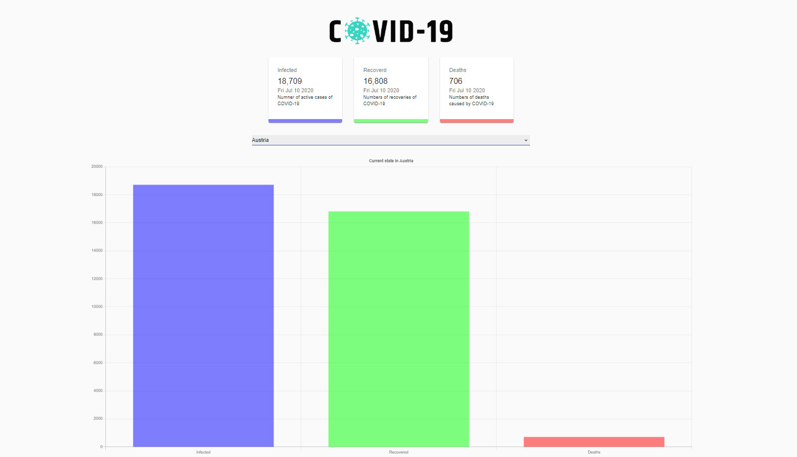

# COVID-19-Tracker-Application 

#### Technologies: 
React, API, Charts.JS, Material UI, HTML, CSS, 
API used: https://covid19.mathdro.id/api

[Project](#Project) |  [Installation Instructions](#Installation) | [Screenshots](#Screenshots) | [Live Site](#Live Site) | 

## <a name="Project">Project</a>
Create a full COVID-19 Tracker

## <a name="Installation">Installation Instructions</a>

1. Fork this repository, clone to your local machine then change into the directory:
```
$ git clone https://github.com/elebecca/COVID-19-Tracker-Application-.git
$ cd Makers
```
2. Run the app on a local server: 
```
$ npm start
```
To view the app navigate to: http://localhost:3030/

## <a name="Screenshots">Screenshots</a>



## <a name="Live Site">[Live Site](https://covid19statswebsite.netlify.com/)</a>
